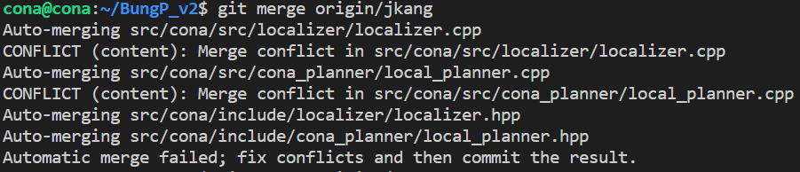
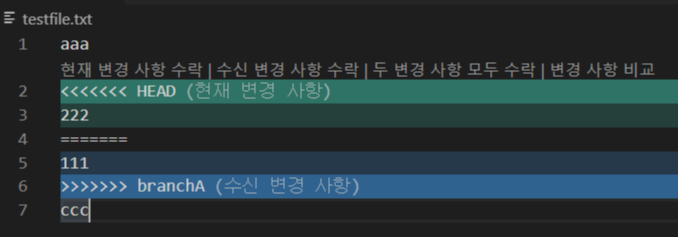
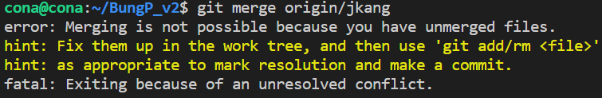
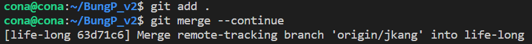

```
다른 브런치와 병합을 하던 중 충돌이 발생했다면, vscode에서 쉽게 아래와 같이 충돌 사항을 알 수 있다.
```




```
하지만, 충돌 사항들을 수락 한 후에 다시 확인 차 병합을 해보니 아래와 같이 에러가 발생한다.
```




```
이때, continue로 다시 병합을 시도하면 정상 병합이 됬음을 알 수 있다.

git add. 
git merge --continue
```

