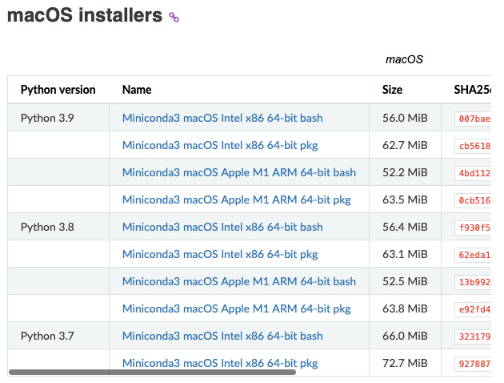
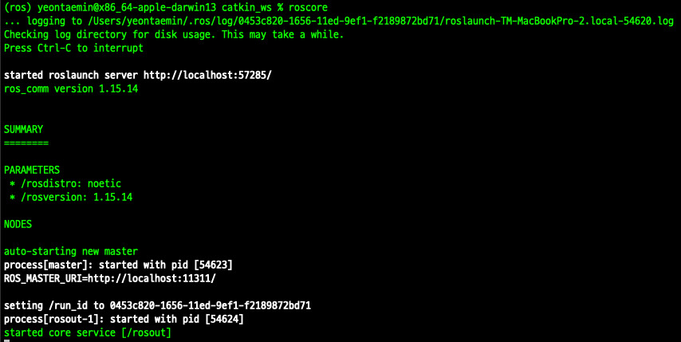
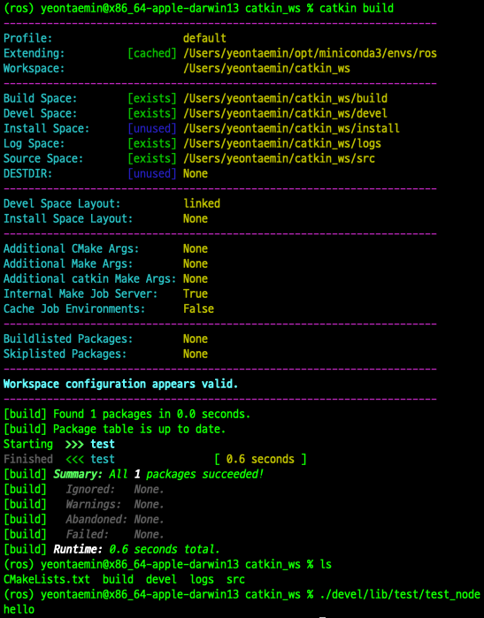
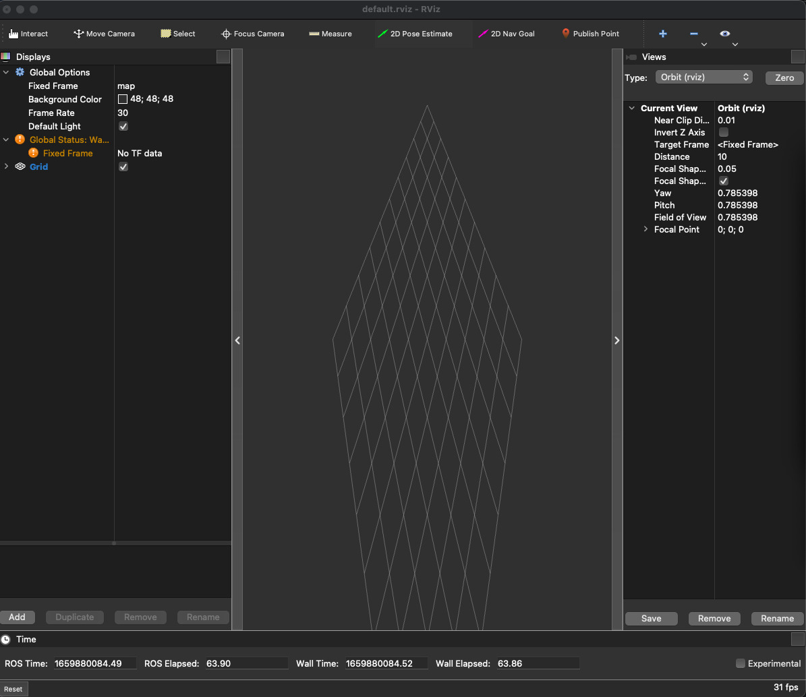

### 1. install miniconda

conda install site: https://docs.conda.io/en/latest/miniconda.html


```
install Python 3.n -> Miniconda3 macOS Intel x86 64-bit pkg
```
### 2. conda env 
```
conda install mamba -c conda-forge

mamba create -n robostack ros-noetic-desktop python=3.9 -c robostack -c robostack-experimental -c conda-forge --no-channel-priority --override-channels

conda activate robostack

mamba install compilers cmake pkg-config make ninja

mamba install catkin_tools

conda deactivate

conda activate robostack

mamba install rosdep

rosdep init

rosdep update

mamba install ros-noetic-std-msgs

```

### 3. roscore
```
roscore
```


### 4. build command
```
cd ~/your_workspace

catkin build
```





---

[Reference]

1. https://github.com/RoboStack/ros-noetic

2. https://robostack.github.io/
